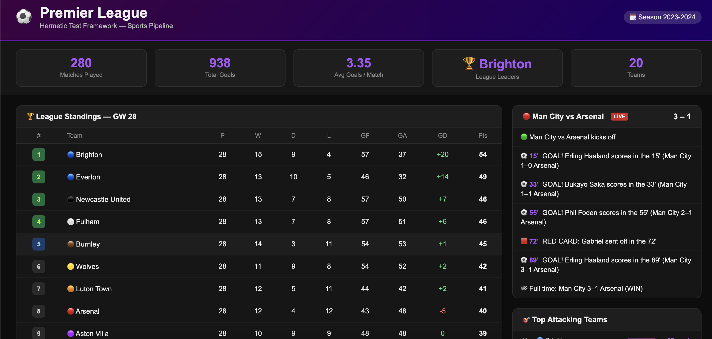
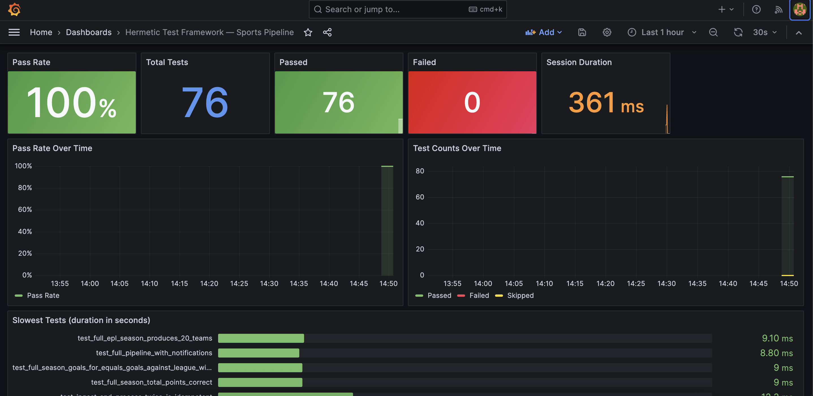

# Hermetic Integration Test Framework

> **Python · pytest · Terraform · Grafana**

A production-grade hermetic integration test framework built around a **Premier League & NBA sports data pipeline**. Every test runs in a fully isolated environment — fresh mock S3, DynamoDB, and SNS clients per test — so tests never share state, never hit a live API, and run in **under half a second**.

---

## Dashboards

### ⚽ Sports Pipeline Dashboard
*Live standings, match scores, goal feed, and top attacking teams — all driven by the hermetic pipeline.*



### 📊 Grafana Test Metrics Dashboard
*Real-time test pass rate, failure counts, slowest tests, and flakiness trends — auto-provisioned, no manual setup.*



---

## What it does

The framework validates a cloud sports data pipeline end-to-end:

```
Sports API → Ingester → S3 (raw JSON)
                           ↓
                     StatsProcessor → DynamoDB (standings, match results, summaries)
                           ↓
                      Notifier → SNS (GoalScored, MatchStarted, RedCard, MatchEnded …)
```

Each layer has hermetic tests. The Grafana dashboard tracks test health over time so flakiness trends are visible across CI runs.

---

## Getting started

```bash
git clone https://github.com/YOUR_USERNAME/hermetic-test-framework
cd hermetic-test-framework

pip3 install -r requirements.txt

# Run all 76 tests
make test

# Interactive sports pipeline demo
python3 scripts/demo.py

# Visual sports dashboard (opens browser)
make dashboard
```

---

## Full stack with Grafana (requires Docker Desktop)

```bash
# Start LocalStack + Prometheus + Grafana
make stack-up

# Run tests (generates metrics)
make test

# Start metrics exporter so Prometheus can scrape it
python3 -m metrics.exporter

# Open Grafana
open http://localhost:3000    # admin / admin
```

The Grafana dashboard auto-provisions — no import needed.

---

## Project structure

```
hermetic-test-framework/
│
├── src/                          Application under test
│   ├── ingestion/
│   │   └── sports_ingester.py    Fetch league fixtures + results → S3
│   ├── processing/
│   │   └── stats_processor.py    Compute standings + summaries → DynamoDB
│   ├── storage/
│   │   └── data_store.py         S3 + DynamoDB helpers
│   └── notifications/
│       └── notifier.py           Publish game events → SNS
│
├── mocks/                        Hermetic simulators (no network, no cloud)
│   ├── sports_api_mock.py        Full EPL + NBA season — deterministic, seeded
│   ├── storage_mock.py           In-memory S3 + DynamoDB (boto3-compatible)
│   └── notification_mock.py      SNS message sink with assertion helpers
│
├── tests/
│   ├── conftest.py               `hermetic` fixture — fresh isolated env per test
│   ├── test_ingestion.py         S3 writes, key naming, score validation (16 tests)
│   ├── test_processing.py        Standings math, parametrize, full season (19 tests)
│   ├── test_notifications.py     Event types, SNS body, message attrs (18 tests)
│   ├── test_pipeline_e2e.py      Full ingest → process → notify (11 tests)
│   └── test_data_integrity.py    League-wide invariants — GF=GA, W+D+L=P (12 tests)
│
├── metrics/
│   ├── collector.py              pytest plugin — records pass/fail/duration per test
│   └── exporter.py               HTTP server at :8765/metrics (Prometheus text format)
│
├── grafana/provisioning/         Auto-provisioned Grafana dashboard JSON
├── terraform/                    LocalStack-backed test environment IaC
│   └── modules/sports-pipeline-env/   S3, DynamoDB, SNS, SQS per run_prefix
├── scripts/
│   ├── demo.py                   Interactive CLI pipeline walkthrough
│   └── sports_dashboard.py       Visual HTML dashboard at localhost:8080
├── docker-compose.yml            LocalStack + Prometheus + Grafana
├── prometheus.yml                Prometheus scrape config
├── Makefile                      All common commands
└── requirements.txt
```

---

## Hermetic design

Each test gets a completely isolated `HermeticEnv` from the `hermetic` fixture:

```python
def test_full_pipeline_with_notifications(hermetic: HermeticEnv):
    # Ingest
    hermetic.ingester.ingest_league_results(hermetic.epl_league_id, hermetic.season)
    # Process
    hermetic.processor.process_league_season(hermetic.epl_league_id, hermetic.season)
    # Simulate live events
    hermetic.notifier.publish_match_start("live-001", "EPL", "Man City", "Arsenal")
    hermetic.notifier.publish_goal("live-001", "EPL", "Man City", "Arsenal", "Haaland", 15, 1, 0)
    hermetic.notifier.publish_match_end("live-001", "EPL", "Man City", "Arsenal", 3, 1)
    # Assert
    assert hermetic.sns.count == 3
    hermetic.sns.assert_published("GoalScored", count=1)
    assert hermetic.sns.messages_of_type("MatchEnded")[0]["result"] == "WIN"
```


## Terraform environment

Each test session provisions an isolated set of AWS resources via Terraform (targeting LocalStack):

```hcl
module "sports_pipeline_env" {
  source     = "./modules/sports-pipeline-env"
  run_prefix = var.run_prefix   # e.g. "ht-20240405-a3f9" — unique per run
}
```

Resources created per run: S3 bucket, DynamoDB table (with GSI), SQS queue + DLQ, SNS topic wired to SQS. `terraform destroy` wipes everything cleanly — no orphaned resources.

---

## Sports data

The `SportsAPISimulator` generates **38 gameweeks of Premier League** and **24 weeks of NBA** data using fixed random seeds — same results every run, no flakiness from live data.

| League | Teams | Matches | Data |
|--------|-------|---------|------|
| Premier League 2023-24 | 20 (all real clubs) | 380 | Fixtures, results, scores, goal events |
| NBA 2023-24 | 10 | 120 | Game schedule, scores |

---

## Grafana metrics

The `MetricsCollector` pytest plugin records every test result and writes two files after each run:

| File | Format | Used by |
|------|--------|---------|
| `metrics/metrics.prom` | Prometheus text | Prometheus scrape → Grafana |
| `metrics/results.json` | JSON | Direct inspection / CI artifacts |

**Dashboard panels:**

| Panel | What it shows |
|-------|--------------|
| Pass Rate | % of tests passing (green ≥ 95%, red < 80%) |
| Total / Passed / Failed / Skipped | Stat cards per run |
| Session Duration | How long the full suite took |
| Pass Rate Over Time | Trend line — spot regressions across runs |
| Test Counts Over Time | Passed / Failed / Skipped stacked |
| Slowest Tests | Top 15 by duration — find bottlenecks |
| Flaky Test Rate | failed / total — surfaces unstable tests |
| Results Table | Per-test outcome with colour coding |

---

## Make commands

| Command | Description |
|---------|-------------|
| `make test` | Run all 76 tests |
| `make test-fast` | Skip slow full-season tests |
| `make test-epl` | Only Premier League tests |
| `make test-nba` | Only NBA tests |
| `make test-e2e` | Full pipeline end-to-end only |
| `make test-parallel` | Run with pytest-xdist (parallel) |
| `make dashboard` | Sports visual dashboard → localhost:8080 |
| `make metrics-server` | Run tests + start Prometheus metrics exporter |
| `make stack-up` | Start Docker stack (LocalStack + Prometheus + Grafana) |
| `make stack-down` | Stop and remove all containers + volumes |
| `make install` | Install Python dependencies |
| `make clean` | Remove cache files and metric outputs |

---

## Test markers

```bash
pytest -m epl          # Premier League tests only
pytest -m nba          # NBA tests only
pytest -m e2e          # End-to-end pipeline tests
pytest -m slow         # Full 38-gameweek season processing
pytest -m integration  # Requires HERMETIC_USE_LOCALSTACK=1 + Docker
```

---

## Tech stack

| Tool | Role |
|------|------|
| Python 3.12 | Application + test framework |
| pytest | Test runner with custom plugin |
| boto3 | AWS SDK (mocked in tests) |
| Terraform | Test environment provisioning (LocalStack) |
| LocalStack | AWS service emulator — S3, DynamoDB, SNS, SQS |
| Prometheus | Metrics collection |
| Grafana | Test health dashboards |
| Docker Compose | Orchestrates LocalStack + Prometheus + Grafana |
